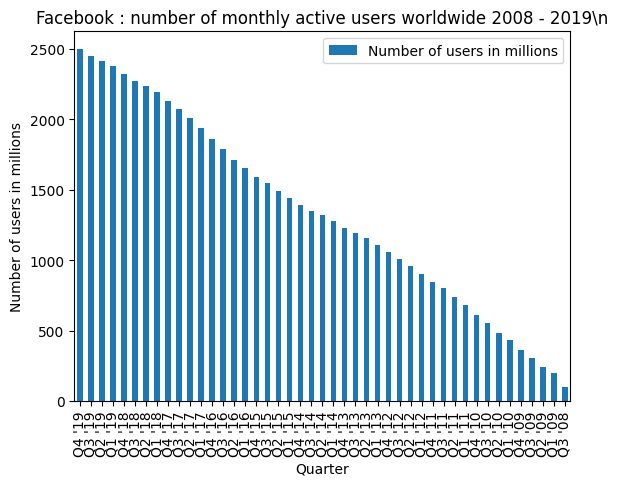

# Chart2Text-heuristics
Chart-to-Text: Generating Natural Language Explanations for Charts via heuristics

Given chart data in CSV format, generate natural language to describe the data.

Inspired by https://github.com/JasonObeid/Chart2Text but taking a simpler approach.

## Usage

1. Convert your chart data into the required file format:

- a CSV file with datapoints. See [example](./examples/dataset/data/1.csv).
- mark important datapoints with a *
- [optional] a matching text file with the chart title. See [example](./examples/dataset/titles/1.txt).

2. Generate a text summary:

```
python3 ./src/generate_summary.py <path to data CSV file>
```

## Dependencies

- pandas 1.4.3

`python3 -m pip install pandas==1.4.3`

### Demo

```
./test.sh
```

OUTPUT:

```
LeBron James has 33655 number of points scored. Carmelo Anthony has 26067 number of points scored. Vince Carter has 25623 number of points scored. Kevin Durant has 22940 number of points scored. Wilt Chamberlain had highest number of points scored 38387.
```

### Examples

Example data is provided in `./dataset`.

The images for the examples are at https://github.com/JasonObeid/Chart2TextImages

#### Example captions generated, with matching chart images

| Chart | Caption (auto-generated) |
|---|---|
|  | Q4 '19 had highest number of users in millions 2498. |
|  | LeBron James has 33655 number of points scored. Carmelo Anthony has 26067 number of points scored. Vince Carter has 25623 number of points scored. Kevin Durant has 22940 number of points scored. Wilt Chamberlain had highest number of points scored 38387. |
|  | Selena Gomez had highest number of followers in millions 334.72. |
|  | Washington Redskins had highest super bowl wins 6. |
|  | Wells Fargo had highest market value in billion u.s. dollars 961.3. |
|  | World of Warcraft had highest share of playing time 6.88%. |

#### More images
The full set of images can be downloaded with the script:

```
./download_images.sh
```

Generate captions for the examples:

```
./test.sh
```