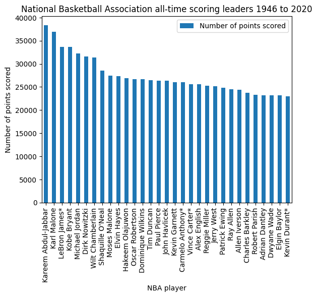
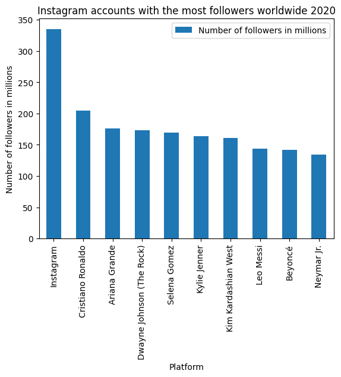
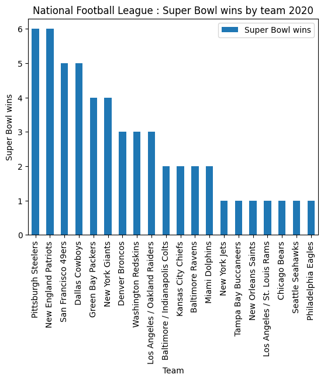
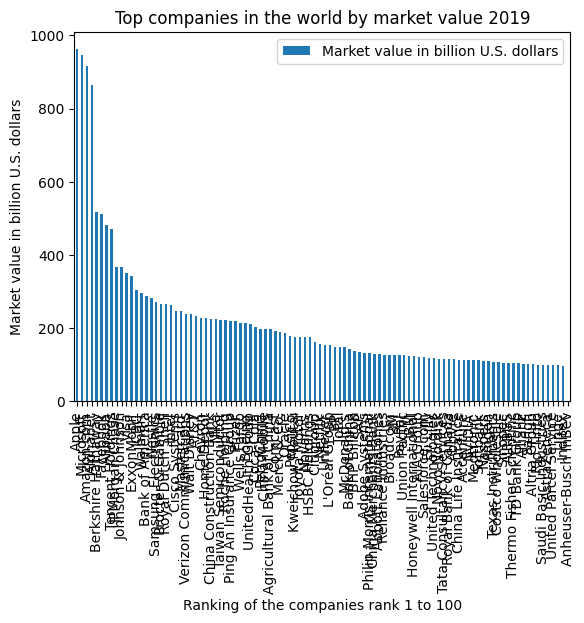
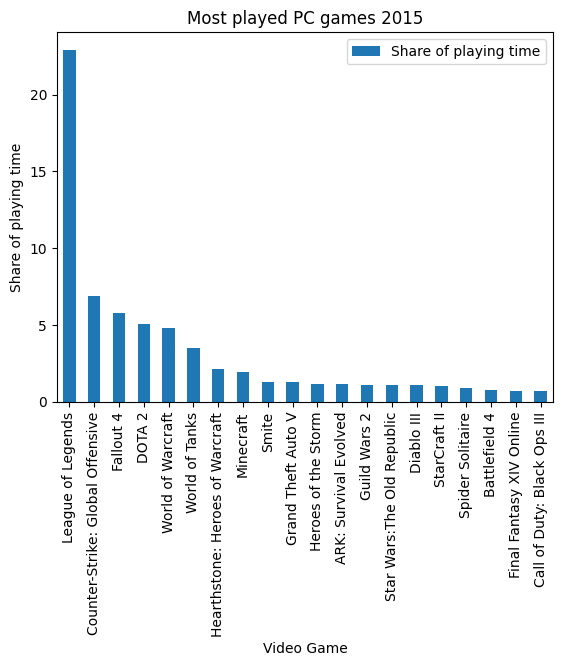
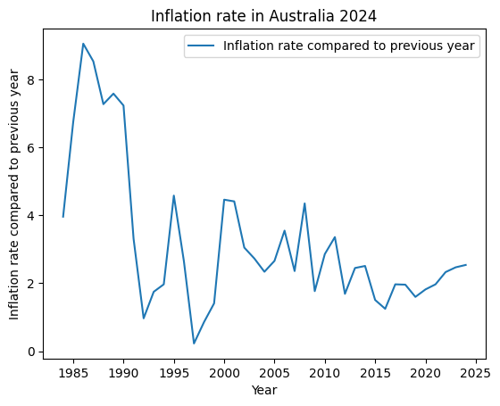
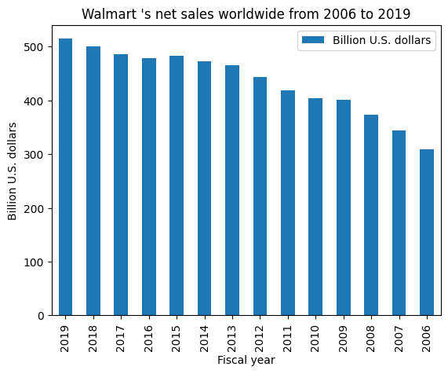
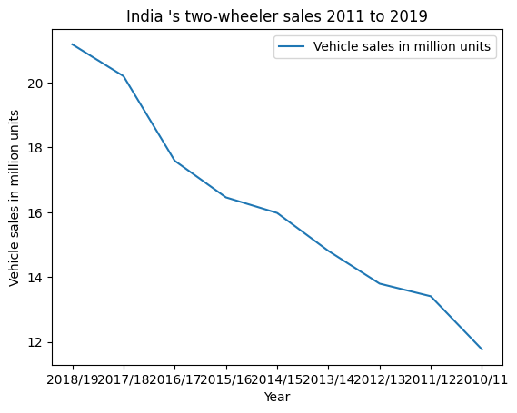
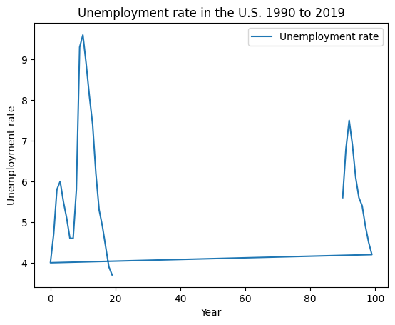

# Chart2Text-heuristics
Chart-to-Text: Generating Natural Language Explanations for Charts via heuristics.

Given chart data in CSV format, generate natural language to describe the data.

Inspired by https://github.com/JasonObeid/Chart2Text but taking a simpler approach.

## Usage

1. Convert your chart data into the required file format:

- a CSV file with datapoints. See [example](./examples/dataset/data/1.csv).
- mark important datapoints with a *
- [optional] a matching text file with the chart title. See [example](./examples/dataset/titles/1.txt).

2. Generate a text summary:

```
python3 ./src/generate_summary.py <path to data CSV file>
```

## Dependencies

- pandas 1.4.3
- pymannkendall 1.4.3

`python3 -m pip install pandas==1.4.3 pymannkendall==1.4.3`

### Demo

```
./test.sh
```

OUTPUT:

```
LeBron James has 33655 number of points scored. Carmelo Anthony has 26067 number of points scored. Vince Carter has 25623 number of points scored. Kevin Durant has 22940 number of points scored. Wilt Chamberlain had highest number of points scored 38387.
```

### Examples

Example data is provided in `./dataset`.

The images for the examples are at https://github.com/JasonObeid/Chart2TextImages

#### Example captions generated, with matching chart images

| Chart | Caption (auto-generated) |
|---|---|
|  | LeBron James, Carmelo Anthony, Vince Carter, Kevin Durant had an average 27071.25 number of points scored. Kareem Abdul-Jabbar had highest number of points scored 38387. |
|  | Instagram had highest number of followers in millions 334.72. |
|  | Pittsburgh Steelers had highest super bowl wins 6. |
|  | Apple had highest market value in billion u.s. dollars 961.3. |
|  | League of Legends had highest share of playing time  22.92%. |

Time-based charts:


| Chart | Caption (auto-generated) |
|---|---|
|  | Q1 '10 to Q1 '09 has an overall increasing trend. Q4 '19 had highest number of users in millions 2498. |
|  | 2024, 2023, 2022, 2021, 2020, 2019 had an average 2.12% inflation rate compared to previous year. 1984 to 2024* has an overall decreasing trend. 1997 had lowest inflation rate compared to previous year 0.23%. |
|  | 2006 to 2019 has an overall increasing trend. 2019 had highest billion u.s. dollars 514.41. |
|  | 2010/11 to 2018/19 has an overall increasing trend. 2018/19 had highest vehicle sales in million units 21.18. |
|  | No overall trend. '10 had highest unemployment rate 9.6%. |

#### More images
The full set of images can be downloaded with the script:

```
./download_images.sh
```

Generate captions for the examples:

```
./test.sh
```

# References

| Topic | Links |
|---|---|
| Trend detection | https://stackoverflow.com/questions/42920537/finding-increasing-trend-in-pandas - https://abhinaya-sridhar-rajaram.medium.com/mann-kendall-test-in-python-for-trend-detection-in-time-series-bfca5b55b |
| Time series support | https://ourcodingclub.github.io/tutorials/pandas-time-series/ — https://towardsdatascience.com/analyzing-time-series-data-in-pandas-be3887fdd621?gi=fabb1396ed42 |
